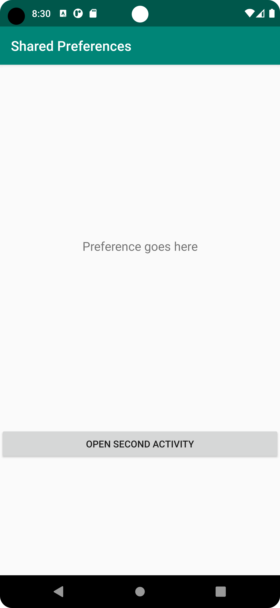
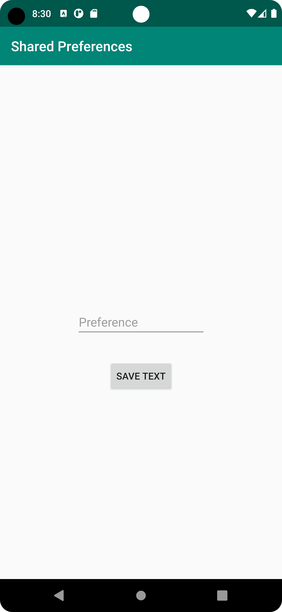

# Rapport

Till att börja med gjorde jag en ny aktivitet kallad SecondActivity. Inuti MainActivity lade jag till
en knapp använde en intent så att SecondActivity öppnas när man trycker på den.
```
button = findViewById(R.id.button);
button.setOnClickListener(new View.OnClickListener() {
    @Override
    public void onClick(View view) {
        Intent intent = new Intent(getApplicationContext(), SecondActivity.class);
        startActivity(intent);
   }
});
```
Därefter lade jag till en EditText på SecondActivity där man kan skriva in sin preferens, samt en 
knapp till att spara preferensen. När sparknappen trycks definieras ett SharedPreference-objekt och 
ändras sedan med hjälp av en SharedPreference.Editor. Genom editorn kallas metoden putString(), där jag
skickar med namnet på strängen jag vill ändra samt den nya strängen. Den nya strängen hämtas
från EditText med hjälp av getText() och getString(). Därefter kallas funktionen apply() för att spara ändringarna.

```
prefEditText = new EditText(this);
prefEditText = findViewById(R.id.editText);
savePref = new Button(this);
savePref = findViewById(R.id.savebtn);
savePref.setOnClickListener(new View.OnClickListener() {
    @Override
    public void onClick(View view) {
        preference = getDefaultSharedPreferences(getApplicationContext());
        prefEditor = preference.edit();
        prefEditor.putString("PreferenceString", prefEditText.getText().toString());
        prefEditor.apply();
    }
});
```

Inuti MainActivity lägger jag till en TextView som ska visa den string som finns sparad i SharedPreferences.
För att åstadkomma detta har jag precis som i SecondActivity både ett SharedPreference-objekt och ett 
SharedPreference.Editor-objekt. För att ändra texten används setText() ihop med getString() kallat via preference-objektet.
Första argumentet är namnet på strängen som ska hämtas, så här skriver jag PreferenceString igen. Andra
argumentet är det som står om ingen preferens hittats. Koden är skriven i onResume() istället för onCreate()
vilket gör att man inte behöver starta om appen för att TextVyn på MainActivity ska uppdateras.

```
@Override
protected void onResume() {
    super.onResume();
    preference = getDefaultSharedPreferences(this);
    prefEditor = preference.edit();
    prefTextView.setText(preference.getString("PreferenceString", "No preference found"));
}
```


